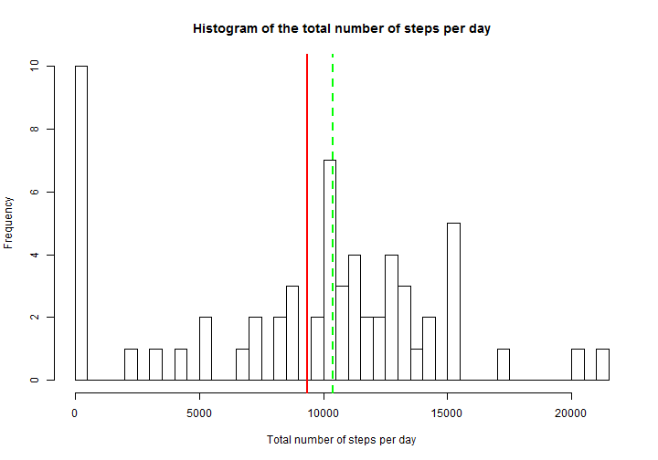
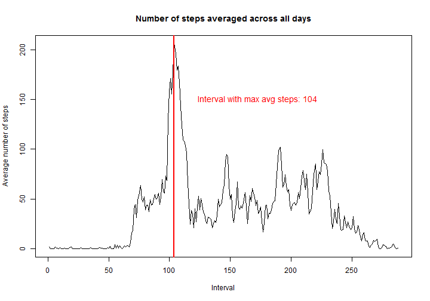
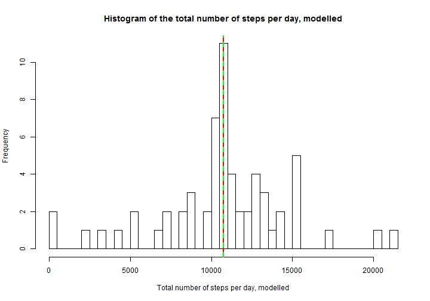
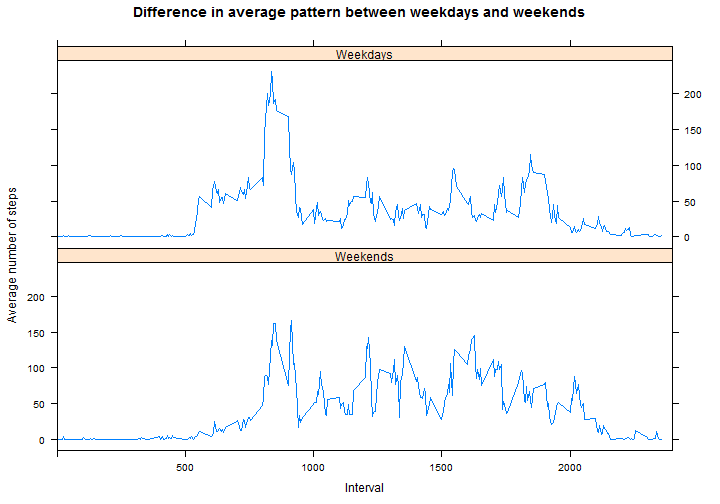

## Loading and preprocessing the data


```r
# adata - activity data
adata <- read.csv("activity.csv", stringsAsFactors = FALSE)
```

## What is mean total number of steps taken per day?

```r
# total number of steps per day, ignoring NAs
adata_total <- tapply(adata$steps, adata$date, sum, na.rm=TRUE)
# mean and median, ignoring NAs
adata_mean <- mean(adata_total, na.rm=TRUE)
adata_median <- median(adata_total, na.rm=TRUE)
print(paste("Mean total number of steps per day:", adata_mean))
```

[1] "Mean total number of steps per day: 9354.22950819672"

```r
print(paste("Median total number of steps per day:", adata_median))
```

[1] "Median total number of steps per day: 10395"

```r
# pretty-printing a histogram with the total number of steps per day
hist(adata_total, breaks=50,
     xlab="Total number of steps per day",
     ylab="Frequency",
     main="Histogram of the total number of steps per day")
abline(v=adata_mean, lwd=2, col="red", lty=1)
abline(v=adata_median, lwd=2, col="green", lty=2)
```

 


## What is the average daily activity pattern?

```r
avg_steps <- tapply(adata$steps, adata$interval, mean, na.rm=TRUE)
plot(avg_steps, type="l",
     main="Number of steps averaged across all days",
     xlab="Interval", ylab="Average number of steps")
abline(v=which.max(avg_steps)[[1]], lwd=2, col="red")
text(120, 150, pos=4,
     labels=paste("Interval with max avg steps:",
                  which.max(avg_steps)[[1]]),
     col="red", cex=1.2)
```

 

## Imputing missing values

```r
missing_data_stats <- lapply(lapply(adata, is.na), sum)
# 2304 rows with NAs, all of them in $steps
missing_data_stats
```

$steps
[1] 2304

$date
[1] 0

$interval
[1] 0

```r
# replacing missing values with average steps for an interval:
# first, constructing data frame with average steps by interval
tmp <- data.frame(interval=names(avg_steps),
                    avgInt=avg_steps)
# second, merging it with adata by interval as key
# (m_adata - modelled activity data)
m_adata <- merge(adata, tmp, by="interval")
rm(tmp)
# third, filling missing values with averages
m_adata$steps[is.na(m_adata$steps)] <- m_adata$avgInt[is.na(m_adata$steps)]
# forth and last, selecting only valuable fields in correct order
m_adata <- m_adata[c(2,3,1)]

# total number of steps per day on the new dataset
m_adata_total <- tapply(m_adata$steps, m_adata$date, sum)
# mean and median on the new dataset
m_adata_mean <- mean(m_adata_total)
m_adata_median <- median(m_adata_total)
print(paste("Mean total number of steps per day, modelled:",
            m_adata_mean))
```

[1] "Mean total number of steps per day, modelled: 10766.1886792453"

```r
print(paste("Median total number of steps per day, modelled:",
            m_adata_median))
```

[1] "Median total number of steps per day, modelled: 10766.1886792453"

```r
# pretty-printing a histogram with the total number of steps per day
# on the dataset with missing values filled with average for an interval
hist(m_adata_total, breaks=50,
     xlab="Total number of steps per day, modelled",
     ylab="Frequency",
     main="Histogram of the total number of steps per day, modelled")
abline(v=m_adata_mean, lwd=2, col="red", lty=1)
abline(v=m_adata_median, lwd=2, col="green", lty=2)
```

 


## Are there differences in activity patterns between weekdays and weekends?

```r
# defaulting a new column for factoring week days/ends
m_adata$is_weekend <- FALSE
# filling weekends with TRUEs
m_adata$is_weekend <-
  weekdays(as.Date(m_adata$date)) == "Saturday" |
  weekdays(as.Date(m_adata$date)) == "Sunday"
# converting to a factor
m_adata$is_weekend <- factor(m_adata$is_weekend,
                             levels=c("TRUE", "FALSE"),
                             labels=c("Weekends", "Weekdays"))
# aggregating average number of steps by interval and weekend factor
m_adata_weekdays <- aggregate(steps ~ interval + is_weekend,
                              data = m_adata, FUN="mean")
```

```r
# plotting
library(lattice)
xyplot(steps ~ interval | is_weekend,
       m_adata_weekdays, type="l", layout=c(1, 2),
       xlim=c(0, 2400),
       xlab="Interval",
       ylab="Average number of steps",
       main="Difference in average pattern between weekdays and weekends")
```

 
